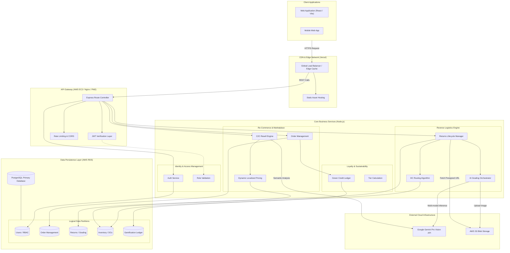
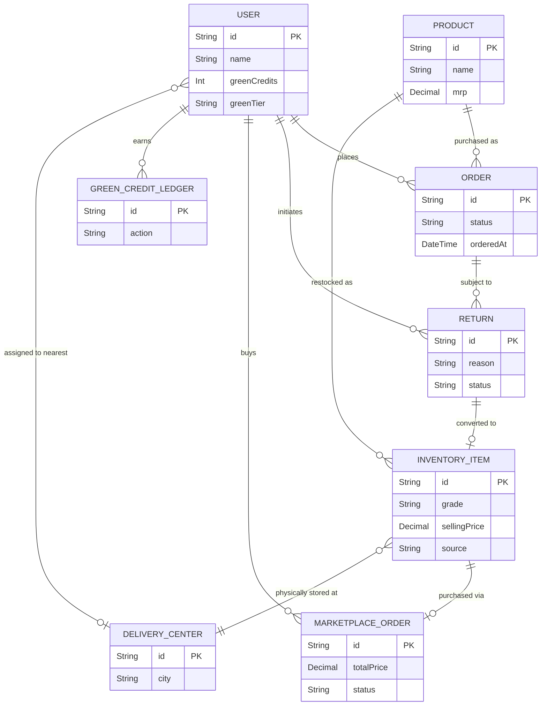
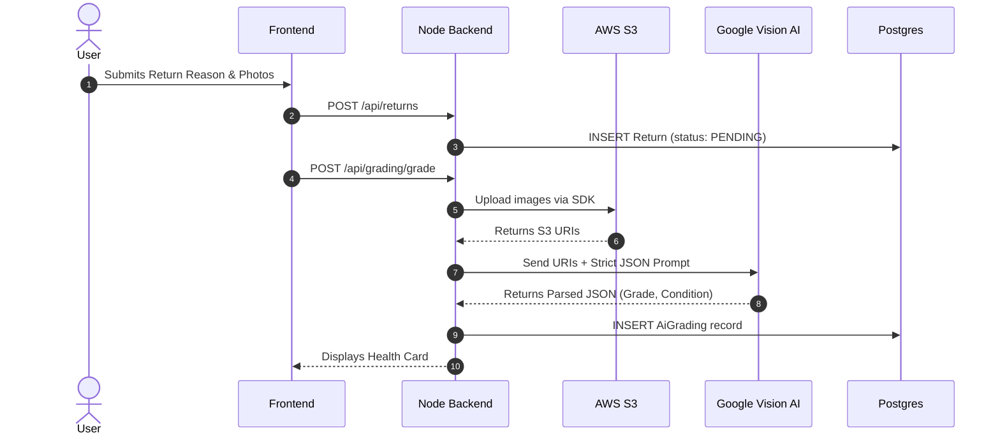
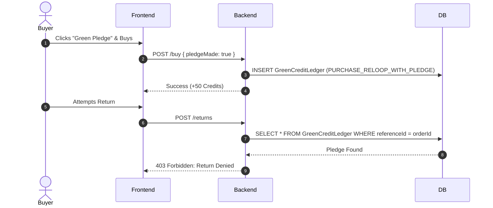
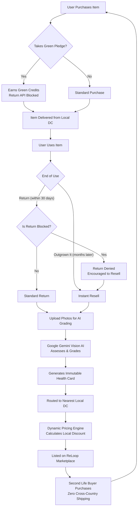

# ReLoop: Comprehensive System Architecture, Engineering & Security Report

---

## 1. Executive Summary & Problem Space

**The Problem:** Traditional e-commerce reverse logistics operates linearly: an item is shipped to a customer, returned to a central warehouse thousands of miles away, manually inspected, and often landfilled due to processing costs. This results in immense carbon emissions, high financial losses, and friction for the end user.

**The ReLoop Solution:** ReLoop transforms reverse logistics into a localized, circular economy. It intercepts returns using proactive friction to prevent them, automates return grading using Vision AI, and reroutes returned goods to localized Delivery Centers for instant, localized resale. This slashes carbon footprints, gamifies sustainable consumer behavior, and establishes a profitable secondary C2C marketplace.

---

## 2. Tech Stack & Deep Component Architecture

While ReLoop is deployed as a monolith for the Hackathon, its internal architecture is designed around bounded contexts and service-oriented modules.

### 2.1. Internal Service Modules
* **Identity & RBAC Service (`auth.js`):** Handles JWT generation, Bcrypt hashing, and role verification (`ADMIN`, `CUSTOMER`, `DELIVERY_PARTNER`, `SELLER`).
* **Reverse Logistics Engine (`returns.js`):** The core state machine. Transitions returns from `PENDING` -> `GRADED` -> `INITIATED` -> `SOLD`. It assigns delivery associates and manages DC routing.
* **AI Vision Service (`gemini.js` & `grading.js`):** Acts as an abstraction layer over the Google Gemini API. It accepts S3 image URIs, constructs structured prompts to force JSON output, and parses the AI's response into database-ready `AiGrading` records.
* **Pricing & Costing Algorithm (`marketplace.js` & `costing.js`):** Dynamically calculates localized pricing. It cross-references `DcRoutes` to compute shipping costs based on the physical distance between the `DeliveryCenter` holding the item and the buyer's nearest DC.
* **Gamification Ledger (`greenCredits.js`):** An append-only ledger (`GreenCreditLedger`) that tracks all sustainable actions (Pledges, Resells, Eco-purchases) and calculates user tiers.

---

## 3. High-Level System Architecture Diagram

---

## 4. Comprehensive Entity-Relationship Diagram (ERD)

---

## 5. Core System Sequences

### 5.1. Zero-Touch AI Return & Grading Flow

### 5.2. Predictive Return Prevention (Strict Block)

### 5.3. End-to-End (E2E) ReLoop Ecosystem Flow

---

## 6. Security & Code Quality

### 6.1. Security Best Practices
* **SQL Injection Prevention:** Prisma ORM completely neutralizes SQL injection by parameterizing all queries at the driver level.
* **Authentication Security:** Passwords are mathematically hashed and salted using Bcrypt.
* **Object-Level Authorization (IDOR Prevention):** The API validates authorization against the exact object owner (e.g., `if (returnRecord.userId !== req.user.id) return 403`) rather than just checking for a valid JWT.
* **Secure Blob Storage:** Node does not host physical image files. Uploads are streamed to S3, mitigating local directory traversal vulnerabilities.

### 6.2. Code Maintainability
* **Modular Express Architecture:** Controllers are cleanly separated by domain (`returns`, `orders`, `grading`).
* **Centralized Error Handling:** Try-catch blocks ensure the Node process does not crash on unhandled promise rejections, hiding stack traces from the client.

---

## 7. ⚠️ Technical Debt, Limitations & Vulnerabilities (Assessor Notes)

*We believe in complete engineering transparency. While ReLoop is a highly functional MVP, a production-ready system would require addressing the following architectural flaws and technical debt.*

### 7.1. Database Scalability & Bottlenecks
* **Dynamic Analytics on Read (`marketplace.js`):** To display the "High Return Risk" banner, the backend executes `prisma.order.count` and `prisma.return.count` dynamically on *every* product load. At millions of rows, this will cause massive database CPU spikes. 
  * **Fix Required:** Implement a materialized view or a Redis caching layer that calculates return velocity asynchronously via a cron job.

### 7.2. Missing Temporal Constraints in Business Logic
* **No Expiration on Returns:** The `POST /api/returns` endpoint does not check if the original `Order` is older than 7 or 30 days. Users can currently return items they purchased years ago.
  * **Fix Required:** Add a `orderedAt` diff check in the backend.

### 7.3. Lack of Distributed Transactions & Orphaned Data
* **S3 vs. Database Atomicity:** In the grading flow, images are uploaded to AWS S3 *before* the database commits the `AiGrading` record. If the database insertion fails (or the Gemini API times out), the images remain in S3 as orphaned files, slowly bloating storage costs.
  * **Fix Required:** Implement a two-phase commit or a background cleanup job (e.g., S3 Object Lifecycle rules) to scrub unreferenced blobs.

### 7.4. AI Hallucinations & Determinism
* **No Human-in-the-Loop (HITL) Fallback:** The system relies 100% on Gemini for grading. If the AI hallucinates a "Grade F" for a brand new item due to bad lighting, or if the Google API experiences an outage, the system has no built-in graceful degradation or manual override queue for admins.
  * **Fix Required:** Implement a threshold (e.g., if `confidenceScore < 0.85`, route to a human admin dashboard for manual grading).

### 7.5. Brittle "Green Pledge" Logic
* **Coupling Business Rules to Logs:** The backend currently blocks returns by querying the `GreenCreditLedger` for a specific string (`PURCHASE_RELOOP_WITH_PLEDGE`). Using a gamification ledger to enforce hard business rules violates the Single Responsibility Principle. If the ledger is cleared or audited, the return block fails.
  * **Fix Required:** Add a dedicated `pledgeMade: boolean` column directly to the `MarketplaceOrder` and `Order` tables in Prisma.
